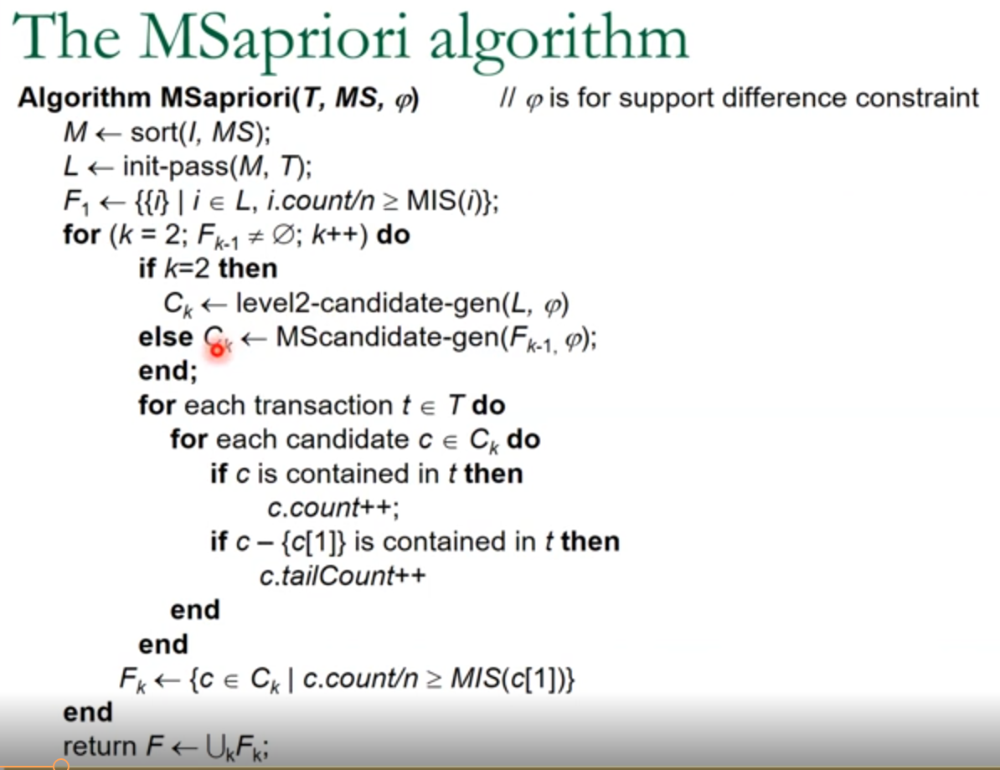

# MS-Apriori-Algorithm

Q. What is MS Apriori Algorithm

Q. Applications / Uses - Theory

Q. Pseudocode

Q. Sample Example

Q. How to Use this code

# Information Gain (Decision Trees)

Q. What is entropy and decision gain ?